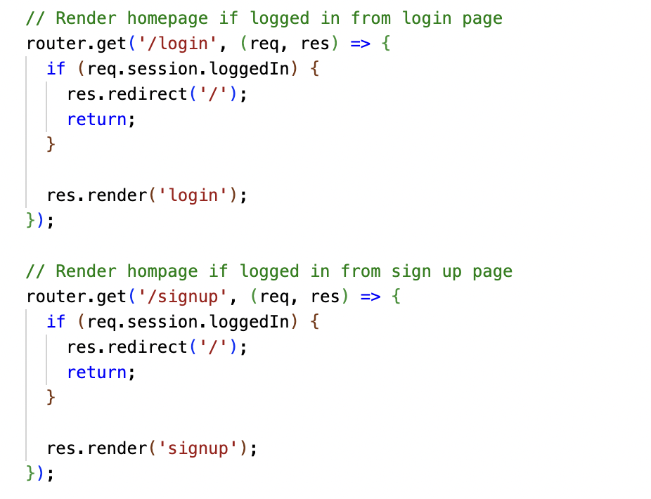
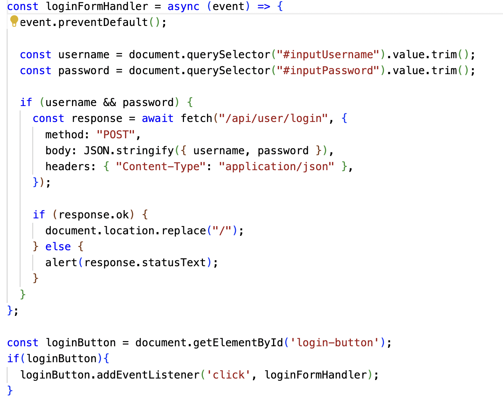
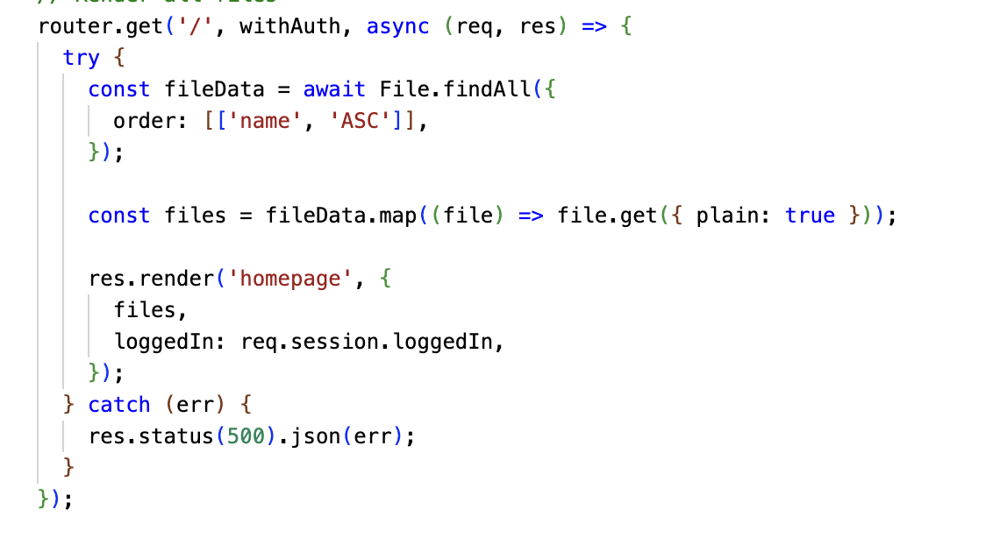
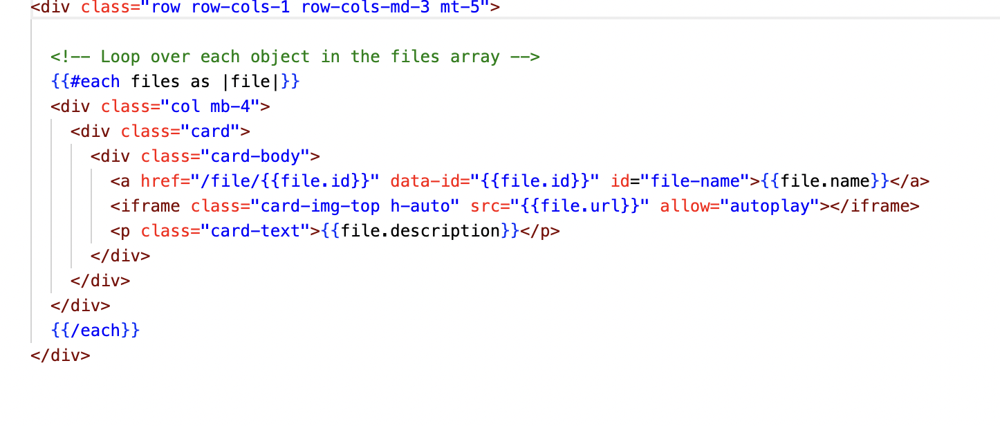
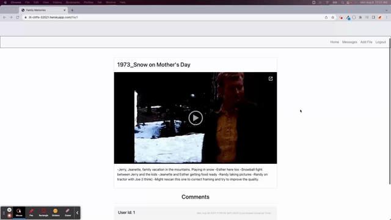
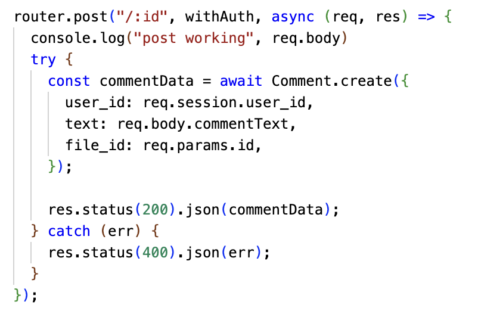
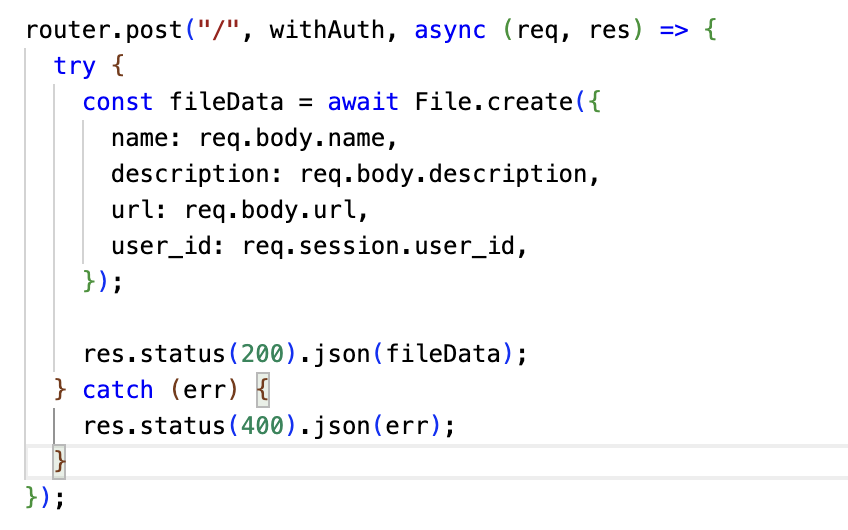
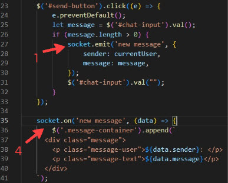
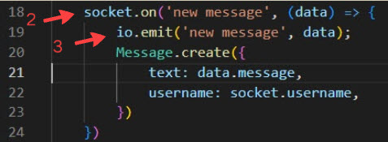
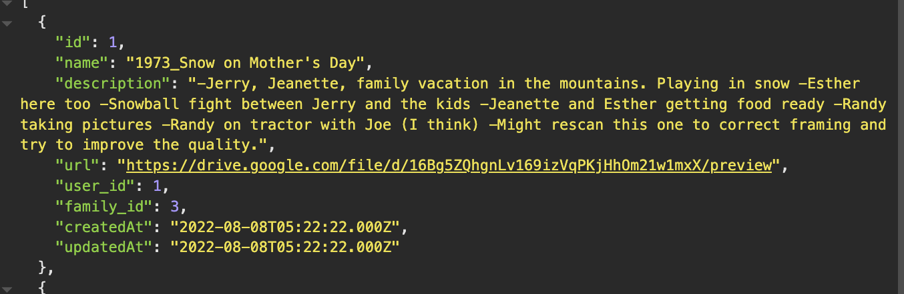

# Family-Memories
This application is a family historical archiving tool to share and manage videos, images, and documents.

---
## Description
This project creates a full-stack application that allows users to share videos, photos, and documents with their family for the purpose of historical archiving. The site contains login, sign up, home, file view, new file, and messaging pages. The homepage contains all your family's stored files in one location. File view allows you to view a single file, it's associated comments, as well as leave new comments. The new file page allows you to upload links from Google Drive, which is used as the site's remote file storage system. The messaging page allows you to view everyone else in your family that is on the chat and to send group messages.

---
### Deployed Link
[Family-Memories](https://lit-cliffs-32521.herokuapp.com/)

---
### Badges
              

---
## Table of Contents
- [Description](#description)
- [Deployed Link](#deployed-link)
- [Usage](#usage)
- [Features](#features)
- [Tests](#tests)
- [References](#references)
- [Credits](#credits)
- [Questions](#questions)
- [License](#license)

---
## Usage

Upon visiting the app, if the user is not logged in, the user is presented with a login screen. If the user already has a registered account, the user can enter their username and password to login. If the user does not have a registered account, the user can click the 'signup' button to be redirected to the signup page. 

After logging in the user is redirected to the home page, where the user is presented with cards containing the title, thumbnail,, and description of each file in the database. The user can click a thumbnail to play the video, or can click the title to be brought to the file page. Here, the user can view the title, watch the video, read the description of the video, and read and leave comments about the video.

If the user clicks the 'Add File' button in the navigation bar, the user is redirected to a form. The user can enter a file name, file description, and a Google Drive link to the file and submit the form. The user will then be brought back to the homepage where the new file can be seen at the end of the file cards.

If the user clicks the 'Messages' button in the navigation bar, the user is redirected to the chat page. THe user is prompted to enter their username and click 'Join Chat'. Once in the chat, the user can read old messages, see other online users, and send new messages.

When the user is ready to leave the site, the user can click the 'Logout' button in the navigation bar and will be returned to the login page.


---
## Features

```
As a user, I want to see a login/signup form...
so I know that my family's content is secure.
```
<br>
The image above on the left is what is happening on the server side. This checks to see if the user is logged using req.session.loggedIn. If they are not logged in, then it will render the /login route from the Handlebars pages. The image on the right is showing the client side javascript and how the user input is gathered in the fetch request. You can see the login and signup buttons in action below. <br>
<br>

```
As a user, I want a homepage...
so that I can see all the uploaded files from my family in one location.
```

<br>
On the server side, there is an async function with a try/catch in order to get some information. First, the fileData variable is finding all the files and ordering them in ascending order. From there, the server is mapping through all of hte files and rendering them on the homepage. The picture on the right is what is happening on the front end using handlebars. There is a div that renders the files as they are added using the each method and grabbing the file id, name, url, and description.

```
As a user, I want a page where I can view an individual file...
so that I can read and add comments.
```
<br>
Below you can see how the comments are created on the server side. The comments are created using a post route in which the variable commentData is declared and takes in the information from the comment model. This includes the user id, text, and file id. <br>


```
As a user, I want  a page with a form...
so that I can submit a new file.
```
<br>
When the Add File button is clicked on the site, it renders the fileForm.handlebars page. On that page, the user can input the name of the file, description, and url. This is a server side image of what is happening on the /file route which creates a new file.

```
AS A family member
I WANT TO be able to send messages to and receive messages from my family
SO THAT we can more easily stay in touch
```
 

These images show how the message content is sent from the client socket to the server socket and then back to any connected client.

In step 1, the message is taken from the input value. The client socket emits the 'new message' event along with an object containing the sender and message text to the server. 

In step 2 the server listens (socket.on) for the'new message' event and then receives the object sent from step 1. In step 3, the server sends the 'new message' event along with the data object back to all connected clients (io.emit). The server also saves the message text and sender to the database in the Message model.

In step 4, the client socket listens for the 'new message' event from the server socket. When that event hits the client socket, the data object is received. The client-side jQuery then inserts the sender and message into the DOM. 

In summary, the client socket sends an event tag and the message data to the server. The server listens for this event, and upon hearing it saves the data to the database and sends the data to all connected clients. Each client then extracts the message sender and text and inserts it into the DOM.


---
## Tests
These routes were tested in insomnia. 

Below, you can see one of the routes we tested which was /api/file/:id.<br>


After getting the route, it produced this json content. The name, description, and url from the json content is what is rendered on each of the file pages. The url is put into an embedded link so the videos are displayed.<br>


This was another route in which we created a comment using a post route.<br>


---
## References

* [socket.io Documentation](https://socket.io/docs/v4/)
* [makeschool.org - Chat](https://makeschool.org/mediabook/oa/tutorials/make-chat/start-slacking/)
* [Stack Overflow - socket.username](https://stackoverflow.com/questions/32657379/how-i-can-get-a-socket-username-socket-io)
* [flexiple - Javascript Dictionary](https://flexiple.com/javascript/javascript-dictionary/)
* [Pietschsoft.com - Dictonary Key/Value Pairs](https://pietschsoft.com/post/2015/09/05/javascript-basics-how-to-create-a-dictionary-with-keyvalue-pairs)

---
## Credits
All original coding credit goes to Phil Besse, Chelsea Burnham, and Brice Veyna. Seed data was provided by Ellen Mitchell with permission from the Mitchell family.

Socket.io chat tutorial credited to [www.makeschool.org](https://makeschool.org/mediabook/oa/tutorials/make-chat/start-slacking/). This was instrumental in coding the chat feature and functionality in our app. 

---
## Questions
If you have any additional questions, feel free to reach out.
### Phil Besse
- [Github](https://github.com/pdbesse)
- [LinkedIn](https://www.linkedin.com/in/phillipbesse/)
- Email: phillip.besse@gmail.com

### Chelsea Burnham
- [Github](http://github.com/chelseaburnham)
- [LinkedIn](www.linkedin.com/in/chelsea-burnham-profile)
- Email: chelseaburnham0@gmail.com

### Brice Veyna
- [Github](https://github.com/BriceVeyna)
- [LinkedIn](https://www.linkedin.com/in/brice-veyna/)
- Email: briceveyna@gmail.com

---
## License
Phil Besse, Chelsea Burnham, and Brice Veyna's Family Memories is licensed under the [MIT License](https://opensource.org/licenses/MIT).

Copyright 2022 Phil Besse, Chelsea Burnham, and Brice Veyna

Permission is hereby granted, free of charge, to any person obtaining a copy of this software and associated documentation files (the "Software"), to deal in the Software without restriction, including without limitation the rights to use, copy, modify, merge, publish, distribute, sublicense, and/or sell copies of the Software, and to permit persons to whom the Software is furnished to do so, subject to the following conditions:

The above copyright notice and this permission notice shall be included in all copies or substantial portions of the Software.

THE SOFTWARE IS PROVIDED "AS IS", WITHOUT WARRANTY OF ANY KIND, EXPRESS OR IMPLIED, INCLUDING BUT NOT LIMITED TO THE WARRANTIES OF MERCHANTABILITY, FITNESS FOR A PARTICULAR PURPOSE AND NONINFRINGEMENT. IN NO EVENT SHALL THE AUTHORS OR COPYRIGHT HOLDERS BE LIABLE FOR ANY CLAIM, DAMAGES OR OTHER LIABILITY, WHETHER IN AN ACTION OF CONTRACT, TORT OR OTHERWISE, ARISING FROM, OUT OF OR IN CONNECTION WITH THE SOFTWARE OR THE USE OR OTHER DEALINGS IN THE SOFTWARE.
